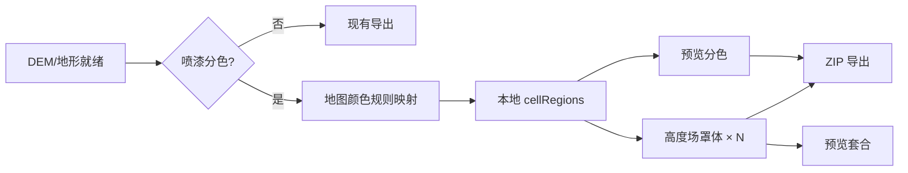

# 喷漆分色遮挡罩与规则配色 — 产品需求文档

| 项目     | 说明                                              |
| -------- | ------------------------------------------------- |
| 产品     | TrailPrint 3D                                     |
| 文档版本 | v0.5                                              |
| 状态     | 已评审，可拆分开发                                |
| 关联能力 | 地形主模型 `Terrain_Main.stl`、3D 预览、ZIP 导出  |
| 开发任务 | 见 [任务索引-喷漆分色.md](./任务索引-喷漆分色.md) |

---

## 1. 背景与目标

当前工作流以 **单色 FDM 打印** 为主：山体预览为白偏黄实体色，打印后用户 **手工喷漆** 上色。喷漆需要 **物理遮挡罩（Stencil Shell）** 限定各色喷涂区域。

本需求在现有「GPX → DEM 地形 → STL」管线之上，增加：

1. **地图颜色规则映射配色**（按地图颜色自动映射到固定地表种类与漆色）
2. **按颜色生成可套合的 3D 遮挡罩**，与山体同坐标系导出
3. **预览中切换查看遮挡罩套合效果**

**成功标准**：用户可在 3D 预览内完成分色 → 套合检查 → 一键导出含遮挡罩的 ZIP，无需第三方建模软件。

---

## 2. 已确认设计决策

以下在 v0.5 中拍板，实现时 **不得再悬而未决**：

| 决策项       | 结论               | 说明                                                                                                                      |
| ------------ | ------------------ | ------------------------------------------------------------------------------------------------------------------------- |
| 遮罩语义     | **负向遮罩**       | 每个罩 = 包络薄壳，**挡住非本颜色区域**，本颜色区域 **开窗** 露出山体待喷                                                 |
| 罩体几何策略 | **高度场薄壳**     | 在 DEM 格点上生成 `Z + clearance + thickness` 顶面壳体，按 `cellRegions` 开窗；**不使用** 大地形 mesh 法向偏移 + 通用 CSG |
| 分区载体     | **`cellRegions`**  | `Uint8Array`，长度 = `cols × rows`（高度场格点），**不是** STL 顶点数                                                     |
| 轨迹线       | **不参与喷漆分区** | `Trail_Line.stl` 仍为独立打印件；遮挡罩仅覆盖 `Terrain_Main` 地表，轨迹喷漆由用户手作                                     |
| 分区策略     | **本地规则映射**   | 基于地图颜色 + 高程 + 坡度，将格点映射到固定种类；不依赖外部服务                                                          |
| 固定种类     | **首期 8 类**      | 山体岩石、建筑、水体、沙地、土路/裸地、雪地、植被、未知兜底                                                               |
| 主入口       | **3D 预览弹窗**    | `TerrainPreviewModal`；侧栏仅高级导出参数                                                                                 |
| 色数         | **首期固定 4 色**  | 后续迭代开放 2～8 色                                                                                                      |

---

## 3. 目标用户与场景

| 角色            | 场景                                               |
| --------------- | -------------------------------------------------- |
| 徒步/越野爱好者 | 打印白模后喷漆还原「绿地 + 裸露山体 + 路径周边」等 |
| 手作玩家        | 2～6 色分喷，不想手刻纸胶带                        |
| 进阶用户        | 微调颜色与分区边界，优化喷漆效果                   |

---

## 4. 功能需求

### 4.1 本地分色与规则配色（F-01）→ [任务-09](./任务-09-喷漆分色-UI与规则分色.md)

| ID     | 需求                                        | 优先级 |
| ------ | ------------------------------------------- | ------ |
| F-01-1 | 3D 预览内「喷漆分色」入口（主入口）         | P0     |
| F-01-2 | 首期固定 4 色；后续支持 2～8 色             | P0     |
| F-01-3 | 固定种类（首期 8 类）与默认色板可见并可编辑 | P0     |
| F-01-4 | 地图颜色自动映射到种类（离线、本地）        | P0     |
| F-01-5 | 每种类可配置 `hex + 标签 + 描述`            | P0     |
| F-01-6 | 本地算法生成 `cellRegions`；预览即时分色    | P0     |
| F-01-7 | 色板逐色替换 hex，分区不变、预览即时更新    | P0     |
| F-01-8 | 「重新分区」与「仅重算颜色映射」            | P1     |
| F-01-9 | 颜色未命中阈值时归类到「未知」并可手动修正  | P1     |

**预览表现**：山体按格点分区着色（仅预览，`Terrain_Main.stl` 仍为单色实体）。

### 4.2 遮挡罩生成（F-02）→ [任务-10](./任务-10-喷漆分色-遮罩壳生成与预览.md)

| ID     | 需求                                                 | 优先级 |
| ------ | ---------------------------------------------------- | ------ |
| F-02-1 | 每色一个 `Mask_Color_{ii}.stl`（ii 零填充两位）      | P0     |
| F-02-2 | 与 `Terrain_Main` 同坐标系（中心、Z 向上、底面齐平） | P0     |
| F-02-3 | 内表面与山体顶面保持 `maskFitToleranceMm` 间隙       | P0     |
| F-02-4 | 负向遮罩：非本颜色区域封闭，本颜色区域顶面开窗       | P0     |
| F-02-5 | 罩体厚度可配置（默认 1.0 mm）                        | P0     |
| F-02-6 | 分区边界 `bleedMarginMm` 过渡带（侵蚀/膨胀）         | P1     |
| F-02-7 | 一体定位框/底座                                      | P2     |

### 4.3 遮挡罩预览（F-03）→ [任务-11](./任务-11-喷漆分色-遮罩套合交互.md)

| ID     | 需求                                    | 优先级 |
| ------ | --------------------------------------- | ------ |
| F-03-1 | 预览内列出 N 个遮挡罩                   | P0     |
| F-03-2 | 点击罩体 → 套合显示（半透明）           | P0     |
| F-03-3 | 视图：山体分色 / 山体+当前罩 / 仅当前罩 | P0     |
| F-03-4 | 选中罩与对应颜色高亮联动                | P0     |
| F-03-5 | 隐藏/显示全部罩体                       | P1     |

### 4.4 导出（F-04）→ [任务-12](./任务-12-喷漆分色-ZIP导出.md)

| ID     | 需求                                       | 优先级 |
| ------ | ------------------------------------------ | ------ |
| F-04-1 | 启用喷漆分色时 ZIP 增加 `Mask_Color_*.stl` | P0     |
| F-04-2 | 附带 `spray_paint_manifest.json`           | P0     |
| F-04-3 | 附带 `spray_paint_preview.png` 俯视分色图  | P1     |
| F-04-4 | 未启用时导出与现版完全一致                 | P0     |

---

## 5. 非功能需求

| 类别     | 要求                                           |
| -------- | ---------------------------------------------- |
| 性能     | 分区计算与罩体生成在主进程异步；预览仅消费结果 |
| 安全     | 全流程本地计算，无外部 API 凭证依赖            |
| 可重复性 | 相同配置 + 分区参数 + 阈值 → 导出几何一致      |
| 可访问性 | 色板显示编号/标签，不仅依赖颜色                |
| 离线     | 全功能离线可用：规则分色 + 手动改色 + 导出罩体 |

---

## 6. 数据模型

```ts
/** AppConfig 扩展 */
interface SprayPaintConfig {
  enabled: boolean;
  colorCount: number; // 首期固定 4；后续: 2–8
  /** 固定种类规则版本，便于后续升级映射逻辑 */
  categoryRuleVersion: number; // 默认 1
  maskShellThicknessMm: number; // 默认 1.0
  maskFitToleranceMm: number; // 默认 0.2（FDM 略松于 trailTolerance）
  bleedMarginMm: number; // 默认 0.5
}

interface SprayColorSlot {
  index: number; // 1-based，对应 Mask_Color_01
  hex: string;
  label: string;
  description?: string; // 规则默认或用户自定义；UI 展示用
  regionId: number; // 0..N-1
}

/** 会话级；随预览/导出传递，后续可持久化到工程文件 */
interface SprayPaintPlan {
  colors: SprayColorSlot[];
  /** 高度场格点分区，行优先，长度 = cols × rows */
  cellRegions: Uint8Array;
  gridCols: number;
  gridRows: number;
  source: "rules" | "manual";
  generatedAt: number;
}

interface SprayMaskMeshPayload extends TerrainMeshPayload {
  colorIndex: number;
  regionId: number;
}
```

**默认值**（`createDefaultConfig`）：

```ts
sprayPaint: {
  enabled: false,
  colorCount: 4,
  categoryRuleVersion: 1,
  maskShellThicknessMm: 1.0,
  maskFitToleranceMm: 0.2,
  bleedMarginMm: 0.5,
}
```

---

## 7. 系统流程



### 7.1 规则分区（首期必达）

对 `heightPreview` 每个格点 `(row, col)`：

1. 读取归一化高程 `elevationNorm`、坡度 `slopeNorm`（由相邻格点差分）。
2. 按 N 档分带分配 `regionId`（默认 4 色：低洼/缓坡绿、中坡土、高坡岩、峰顶浅）。
3. 后处理：3×3 邻域多数投票平滑；剔除面积 < 0.5% 的孤岛（合并到邻域众数）。

### 7.2 地图颜色规则映射

**目标**：将地图像素稳定映射到固定地表种类，不依赖网络与外部模型。

**固定种类（首期）**：

1. 山体岩石
2. 建筑
3. 水体
4. 沙地
5. 土路/裸地
6. 雪地
7. 植被
8. 未知（兜底）

**输入**（主进程组装）：

| 资产                 | 说明                                                                    |
| -------------------- | ----------------------------------------------------------------------- |
| `satellite_crop.png` | 与裁剪区一致的卫星图（主进程瓦片拼接，逻辑对齐 `satellite-imagery.ts`） |
| `elevation_map.png`  | `heightPreview` 归一化灰度                                              |
| `meta.json`          | `colorCount`、mm 尺寸、形状、是否有水体提示                             |

**映射流程**：

1. 格点特征：`[R, G, B, elevationNorm, slopeNorm]`。
2. 将 RGB 转 Lab/HSV，与各类别基准色计算距离，结合高程/坡度规则打分。
3. 取最高分为 `regionId`；若未达阈值则归入「未知」。
4. 冲突按优先级消解：水体 > 雪地 > 建筑 > 沙地 > 土路/裸地 > 山体岩石 > 植被 > 未知。
5. 同 7.1 后处理（平滑 + 孤岛合并）。

### 7.3 遮挡罩几何（高度场薄壳）

对每个 `regionId = k` 的罩体：

1. **包络顶面**：`Z_shell(row,col) = Z_terrain(row,col) + maskFitToleranceMm + maskShellThicknessMm`。
2. **开窗**：`cellRegions[row,col] === k` 的格点，顶面三角 **不生成**（孔洞）；其余格点生成顶面 quad → 两三角。
3. **侧壁**：沿 footprint 外轮廓与开窗边界，从 `Z_terrain + maskFitToleranceMm` 拉到 `Z_shell` 形成围挡（复用 `heightfield-mesh` 封边思路）。
4. **底缘**：可选薄底环连接侧壁，保证件可坐立；Z 与 `Terrain_Main.bottomZ` 齐平或略外扩 0.2 mm。
5. **边界过渡**：若 `bleedMarginMm > 0`，对分区 mask 做格点级侵蚀/膨胀后再开窗。
6. **校验**：`assertWatertightMesh`；陡崖坡度 > 70° 时 UI 警告「该方向可能溢色」。

> **禁止**：对完整 `Terrain_Main` mesh 做法向 offset + `three-bvh-csg` 布尔（性能与成功率不足）。

### 7.4 预览着色映射

`cellRegions` 定义在规则格点上；`buildHeightfieldTerrainMesh` 产出的顶面顶点可能与格点不一一对应（圆盘极坐标、多边形裁剪）。映射规则：

- 顶面顶点按 `(x,y)` 反查最近格点 `(row,col)` 取 `regionId`；
- 或使用格点色纹理 / 逐三角重心采样 `cellRegions`。

---

## 8. UI 概要

**主面板**：`TerrainPreviewModal` 右侧可折叠「喷漆分色」

| 区域   | 内容                               |
| ------ | ---------------------------------- |
| 操作   | 「规则分色（离线）」；「重新分区」 |
| 色板   | N 行：编号 + 色票 + 标签 + 拾色器  |
| 遮挡罩 | N 行：名称 + 套合开关              |
| 视图   | 山体分色 / 山体+罩 / 仅罩          |
| 状态   | 分区中、生成罩体中、失败重试       |

**侧栏**（可选）：`ControlSidebar` 折叠区「喷漆导出参数」— 厚度、间隙、过渡宽度。

---

## 9. 导出文件规范

| 文件                        | 说明                     |
| --------------------------- | ------------------------ |
| `Terrain_Main.stl`          | 不变                     |
| `Trail_Line.stl`            | 不变                     |
| `Tray_Base.stl`             | 不变                     |
| `Mask_Color_01.stl` …       | 新增                     |
| `spray_paint_manifest.json` | 颜色、参数、格点分区摘要 |

```json
{
  "version": 1,
  "colorCount": 4,
  "colors": [
    {
      "index": 1,
      "hex": "#5A8F4A",
      "label": "植被",
      "stl": "Mask_Color_01.stl",
      "regionId": 0
    }
  ],
  "maskShellThicknessMm": 1.0,
  "maskFitToleranceMm": 0.2,
  "bleedMarginMm": 0.5,
  "terrainStl": "Terrain_Main.stl",
  "maskMode": "negative"
}
```

---

## 10. 风险与对策

| 风险                | 对策                                          |
| ------------------- | --------------------------------------------- |
| 分区边界锯齿 / 溢色 | 邻域平滑 + `bleedMarginMm` + 后续笔刷编辑     |
| 陡崖套合缝隙        | 告警 + 用户调大 `maskFitToleranceMm`          |
| 罩体件数多          | 默认 4 色；>6 色时 UI 提示打印成本            |
| 卫星图主进程获取    | 任务-09 内实现瓦片拉取，与渲染进程解耦        |
| 地图颜色误判        | 阈值 + 类别优先级 + 平滑；允许手动改色/重分区 |

---

## 11. 开发任务拆分

| 任务 | 文档                                                       | 范围                               | 依赖             |
| ---- | ---------------------------------------------------------- | ---------------------------------- | ---------------- |
| 09   | [UI 与规则分色](./任务-09-喷漆分色-UI与规则分色.md)        | 面板、规则分色、颜色映射、预览着色 | 任务-03、任务-08 |
| 10   | [遮罩壳生成与预览](./任务-10-喷漆分色-遮罩壳生成与预览.md) | 高度场薄壳算法、罩体列表、静态预览 | 任务-09          |
| 11   | [遮罩套合交互](./任务-11-喷漆分色-遮罩套合交互.md)         | 点击罩体套合、视图切换、色罩联动   | 任务-09、任务-10 |
| 12   | [ZIP 导出](./任务-12-喷漆分色-ZIP导出.md)                  | Mask STL + manifest 打包           | 任务-07、任务-10 |

详见 [任务索引-喷漆分色.md](./任务索引-喷漆分色.md)。

---

## 12. 验收标准

### 首期 MVP

1. 预览弹窗有「喷漆分色」面板；侧栏无重复主入口。
2. 「规则分色」后山体显示 4 色区域。
3. 规则分色与颜色映射稳定可用；颜色未命中时归入「未知」并可手动调整。
4. 修改色块 hex 后 1 秒内预览更新。
5. 生成 4 个遮挡罩并在列表中可预览。
6. 点击某一罩体可套合预览；该罩仅暴露对应 region 喷涂窗口。
7. 导出 ZIP 含 4 个 `Mask_Color_XX.stl` + manifest；切片软件无破面报错。
8. `sprayPaint.enabled === false` 时导出与现版一致。

### 后续迭代

9. 颜色数量可在 2～8 间调整并重算。
10. 附带 `spray_paint_preview.png` 俯视分色图。
11. 笔刷编辑分区、定位销、工程持久化。

### 物理验证（建议人工）

12. 至少一组真实 FDM 打印：白模 + 4 套罩实喷，溢色可接受。

---

## 13. 代码集成点

| 模块                                             | 改动                 |
| ------------------------------------------------ | -------------------- |
| `shared/types/config.ts`                         | `SprayPaintConfig`   |
| `shared/types/spray-paint.ts`                    | Plan、Mask、IPC 载荷 |
| `shared/ipc/channels.ts`                         | 喷漆相关 channel     |
| `electron/main/spray-paint/`                     | 分区、罩体、颜色映射 |
| `electron/main/export/export-service.ts`         | ZIP 扩展             |
| `src/components/preview/TerrainPreviewModal.vue` | 主面板               |
| `src/components/preview/TerrainMeshPreview.vue`  | 分色 + 罩体          |
| `src/components/layout/ControlSidebar.vue`       | 高级参数（可选）     |

---

## 14. 结论

需求 **合理且可落地**。v0.5 将罩体算法收敛为 **高度场薄壳 + 负向遮罩**，分区定义在 **DEM 格点** 上，与现有 `heightPreview` / `buildHeightfieldTerrainMesh` 管线一致；配色采用 **地图颜色规则映射 + 固定种类**。按 [任务索引-喷漆分色.md](./任务索引-喷漆分色.md) 顺序实施即可。
