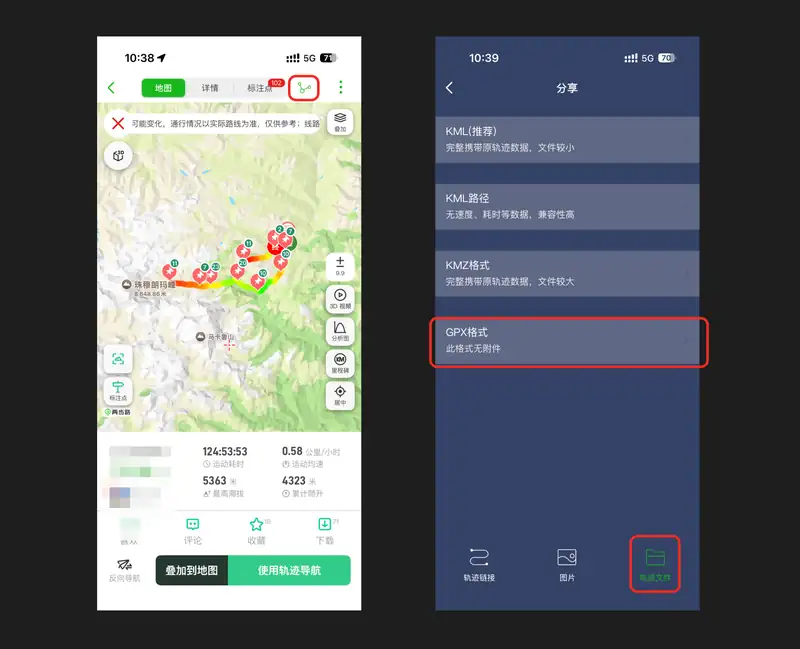
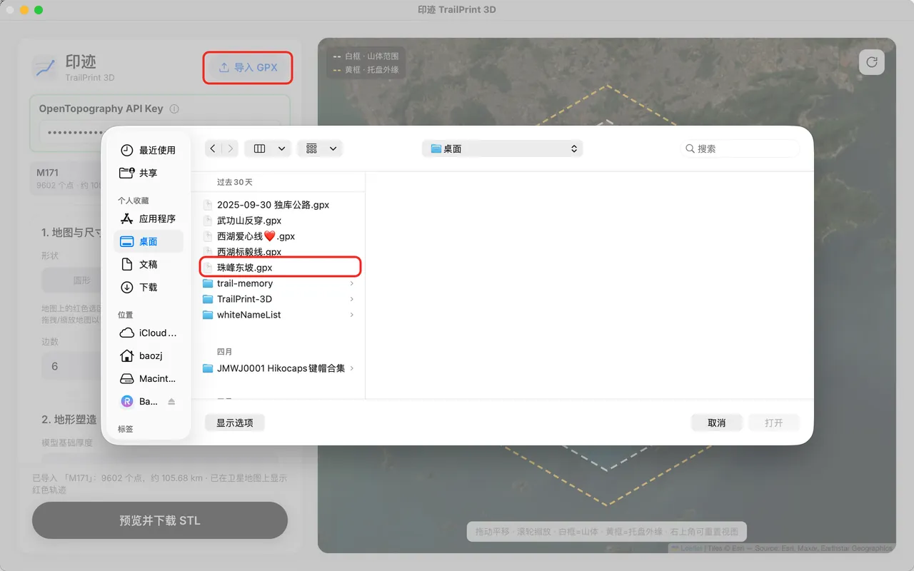
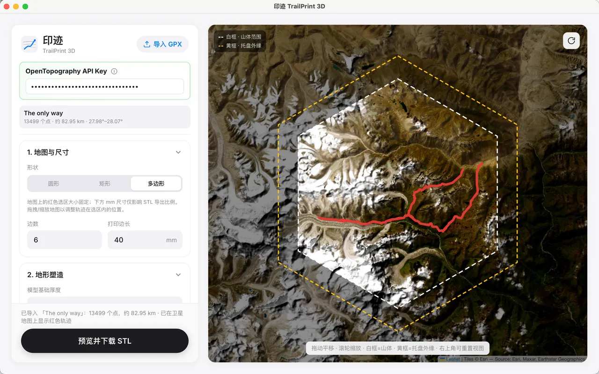
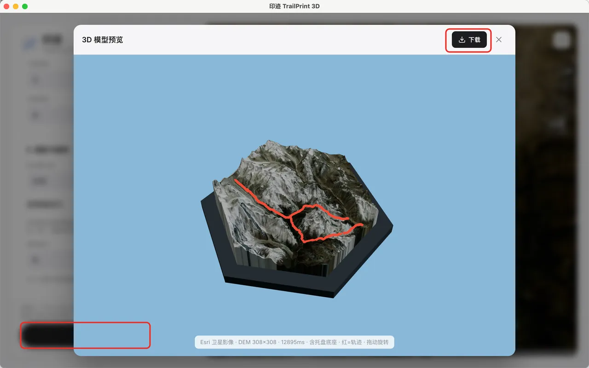
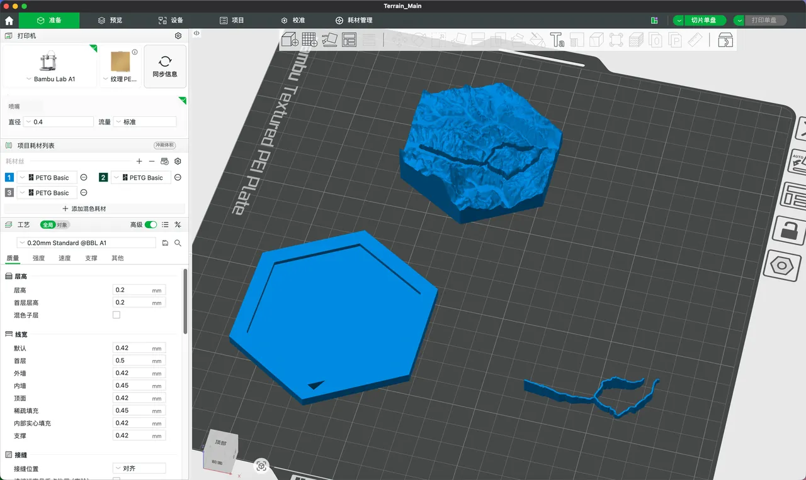
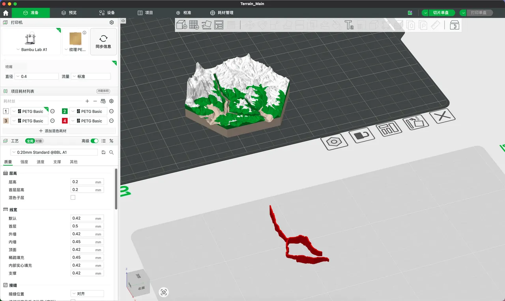
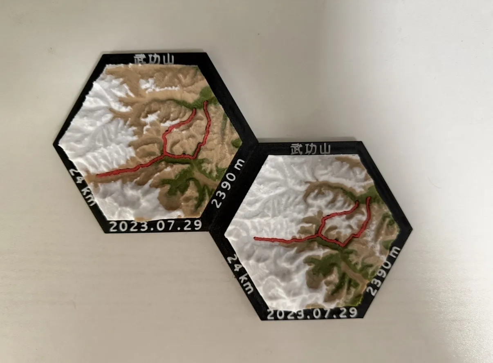
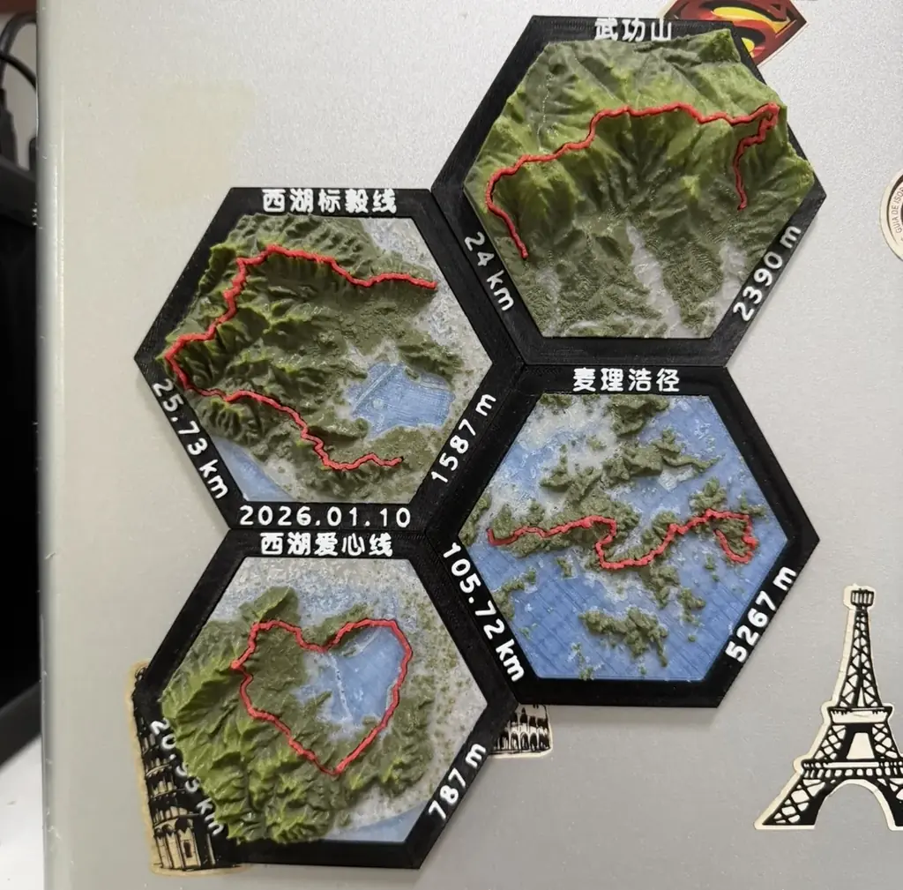

# 🏔️ 印迹 TrailPrint 3D

**将徒步轨迹导出为可 3D 打印的地形模型。**

「印迹 TrailPrint 3D」是一款桌面工具，用于把 GPX 运动轨迹与真实地形高程结合，生成可直接用于多色 3D 打印的 STL 模型。上传轨迹后，可在地图上调整取景范围，设置打印尺寸与地形参数，并导出分件模型。

---

## 🛠️ 操作流程

操作截图统一放在 `docs/images/readme/` 目录，将下方占位路径替换为实际图片文件名即可。

### 0. 获取 GPX 文件（两步路）

在 [两步路](https://www.2bulu.com/) 中打开目标轨迹，导出为 `.gpx` 文件，供后续导入使用。

<!-- 截图：两步路中打开轨迹并导出 GPX -->



### 1. 导入轨迹

启动应用后，上传上一步导出的 `.gpx` 文件。

<!-- 截图：上传 GPX 文件 -->



### 2. 构图取景与调整参数

选择底座形状，在地图上拖动、缩放轨迹位置；同时在侧栏设置山体高度、表面平滑、托盘底座，以及拼装公差与磁吸孔位等参数。

<!-- 截图：地图取景 + 侧栏参数面板（一张图） -->



### 3. 导出模型

确认预览无误后，生成并下载打包好的 3D 模型压缩包。

<!-- 截图：导出与下载 -->



### 4. 导入 Bambu Studio 并上色

解压下载的压缩包，将 `Terrain_Main.stl`、`Trail_Line.stl`、`Tray_Base.stl` 三个文件拖入 [Bambu Studio](https://bambulab.com/zh/download/studio)，为山体、轨迹与底座分别指定耗材颜色，预览多色拼装效果后即可切片打印。

<!-- 截图：Bambu Studio 中导入三个 STL -->



<!-- 截图：Bambu Studio 中上色后的预览效果 -->



### 5. 打印成品

切片发送打印后，将山体、轨迹与底座拼装完成，即可得到实体地形模型。

<!-- 实拍：3D 打印成品效果 -->





---

## 🚀 快速开始

本项目为 **Electron + Vue 3** 桌面应用，使用 npm 管理依赖。

### 环境要求

- [Node.js](https://nodejs.org/) 18 或更高版本
- npm（随 Node.js 安装）

### 安装与启动

```bash
# 克隆仓库后进入项目目录
cd TrailPrint-3D

# 安装依赖
npm install

# 启动开发模式（会打开 Electron 窗口）
npm run dev
```

### OpenTopography API Key

地形高程数据来自 [OpenTopography](https://portal.opentopography.org/requestService?service=api)。启动应用后，在侧栏顶部的 **OpenTopography API Key** 卡片中填写你的 Key（[免费注册申请](https://portal.opentopography.org/requestService?service=api)）。Key 仅保存在本机，不会随仓库分发。

### 可选环境变量

复制 `.env.example` 为 `.env` 可配置开发用选项。API Key 也可通过环境变量预填（非必需）：

```bash
OPENTOPOGRAPHY_API_KEY=你的密钥
VITE_OPENTOPOGRAPHY_API_KEY=你的密钥
```

高精度制版或自定义分辨率较大时，可提高 V8 堆内存上限（单位 MB，默认 8192）：

```bash
TRAILPRINT_HEAP_MB=8192
```

### 其他命令

| 命令                | 说明                                    |
| ------------------- | --------------------------------------- |
| `npm run dev`       | 开发模式，热更新                        |
| `npm run build`     | 构建生产产物到 `out/`                   |
| `npm run preview`   | 预览构建后的应用                        |
| `npm run package`   | 构建并打包为安装包（输出到 `release/`） |
| `npm run typecheck` | TypeScript 类型检查                     |

---

## ✨ 核心功能

### 🗺️ 1. 构图与地图裁剪

- **底座形状：** 支持圆形、矩形或正多边形裁剪范围。
- **打印尺寸：** 按实际打印尺寸（如 150mm × 150mm）等比缩放模型。
- **地图取景：** 在地图上平移、缩放，框选需要保留的轨迹与地形区域。

### ⛰️ 2. 地形生成与轨迹处理

- **高度倍数：** 可按需拉高 Z 轴山体高度，弥补真实地形缩放后起伏不明显的问题。
- **表面平滑：** 提供低、中、高三档平滑，减少地形毛刺与阶梯感，便于打印。
- **轨迹过滤：** 过滤 GPX 中的 GPS 漂移与噪点，使路线线条更连贯。

### 🖼️ 3. 托盘底座

- **内嵌式结构：** 自动生成包裹山体主模型的画框式底座。
- **可调参数：** 可设置总厚度、下陷深度与边框宽度，以适配不同打印与摆放需求。

### 🧩 4. 分件打印与组装

面向多色打印与后期拼装，提供以下能力：

- **打印公差：** 可分别设置轨迹槽与底座槽的预留公差（如 0.15mm），补偿耗材膨胀带来的尺寸偏差。
- **磁铁孔位：** 输入磁铁直径与厚度后，自动在地形与底座内部生成对齐的孔位，便于磁吸固定，无需胶水。
- **冰箱贴模式：** 可在底座底部额外生成磁铁孔，使模型可吸附在铁质表面。

---

## 📦 交付物说明

点击生成后，将获得包含以下 3 个 `.stl` 文件的压缩包：

- **`Terrain_Main.stl`**：带基础厚度的山体主模型，表面已挖出轨迹凹槽。
- **`Trail_Line.stl`**：独立轨迹线条模型，已应用缩小公差，用于换色打印。
- **`Tray_Base.stl`**：托盘底座，含内嵌凹槽与磁铁孔位。

将三个文件分别导入切片软件，按需要设置颜色与打印参数后即可开始打印。
