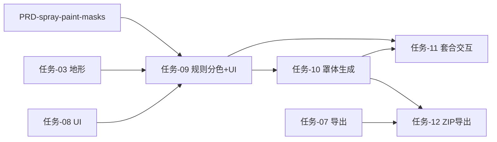

# 喷漆分色 · 开发任务索引

> 由 [`PRD-spray-paint-masks.md`](./PRD-spray-paint-masks.md) 拆分。每个任务为 **AI IDE 可独立执行** 的最小交付单元，含范围、接口、验收与文件清单。

## 产品增量概览

| 项 | 内容 |
| --- | --- |
| 能力 | 地图颜色规则映射 → 格点分区 → 负向遮挡罩 STL → 预览套合 → ZIP 导出 |
| 主入口 | `TerrainPreviewModal` 右侧「喷漆分色」面板 |
| 首期约束 | 分类 8 类；喷漆色/罩体数 `colorCount` 默认 4（可合并类别，见任务-09） |
| 技术约束 | 分区在 DEM 格点 `cellRegions`；罩体为高度场薄壳；全流程离线 |

## 任务清单

| ID | 文件 | 优先级 | 依赖 | 状态 |
| --- | --- | --- | --- | --- |
| 09 | [任务-09-喷漆分色-UI与规则分色](./任务-09-喷漆分色-UI与规则分色.md) | P0 | 任务-03、任务-08 | 已完成 |
| 10 | [任务-10-喷漆分色-遮罩壳生成与预览](./任务-10-喷漆分色-遮罩壳生成与预览.md) | P0 | 任务-09 | 已完成 |
| 11 | [任务-11-喷漆分色-遮罩套合交互](./任务-11-喷漆分色-遮罩套合交互.md) | P0 | 任务-09、任务-10 | 已完成 |
| 12 | [任务-12-喷漆分色-ZIP导出](./任务-12-喷漆分色-ZIP导出.md) | P0 | 任务-07、任务-10 | 已完成 |

## 建议实施顺序

## 跨任务共享约定

### 数据模型（任务-09 定义，后续只读扩展）

- `SprayPaintConfig` — 写入 `AppConfig.sprayPaint`
- `SprayPaintPlan` — 会话级：`colors` + `cellRegions` + 网格尺寸
- `SprayMaskMeshPayload` — 单罩 mesh，供预览与导出

### IPC 命名（任务-09 注册，10/11/12 复用）

| Channel | 方向 | 用途 |
| --- | --- | --- |
| `spray:segment` | invoke | 规则分色 → `SprayPaintPlan` |
| `spray:generate-masks` | invoke | 由 plan 生成 N 个罩体 mesh |
| `spray:progress` | event | 分区/罩体进度 |

### 设计决策（不可偏离）

| 项 | 结论 |
| --- | --- |
| 遮罩语义 | 负向遮罩：非本区封闭，本区顶面开窗 |
| 几何 | 高度场薄壳；禁止大地形 mesh CSG |
| 分区载体 | `Uint8Array`，长度 = `cols × rows` |
| 轨迹 | `Trail_Line` 不参与喷漆分区 |

## 参考文档

- [PRD-spray-paint-masks.md](./PRD-spray-paint-masks.md) — 需求全文
- [任务索引.md](./任务索引.md) — 主项目任务索引
