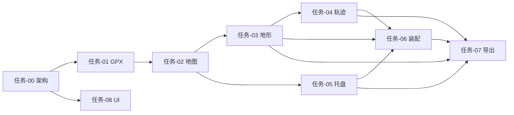

# 印迹 TrailPrint 3D · 开发任务索引

> 由 [`需求文档.md`](./需求文档.md) 拆分而来。拆分方法遵循项目内 [`doc-coauthoring`](./.claude/skills/doc-coauthoring/SKILL.md) 对 PRD/技术规格文档的结构化组织原则：按读者可独立执行的最小交付单元划分，并标注依赖关系。

## 产品概览

| 项 | 内容 |
| --- | --- |
| 产品名 | 印迹 TrailPrint 3D |
| 定位 | GPX 轨迹 → 可分色打印、免胶水磁吸拼装的托盘式 3D 地形纪念碑 |
| 核心交付 | ZIP（`Terrain_Main.stl` / `Trail_Line.stl` / `Tray_Base.stl`） |
| 技术栈 | Electron + Vue 3（渲染进程 UI / 主进程重度计算） |

## 用户旅程 ↔ 任务映射

| 旅程步骤 | 主要任务 |
| --- | --- |
| 1. 导入 GPX | [任务-01](./任务-01-GPX导入与全局状态.md) |
| 2. 框选 | [任务-02](./任务-02-模块一-地图选取与尺寸.md) |
| 3. 塑形 | [任务-03](./任务-03-模块二-主模型生成.md)、[任务-04](./任务-04-模块三-轨迹模型生成.md) |
| 4. 托盘底座 | [任务-05](./任务-05-模块四-托盘底座.md) |
| 5. 装配 | [任务-06](./任务-06-模块五-打印装配与磁铁.md) |
| 6. 导出 | [任务-07](./任务-07-STL导出与ZIP交付.md) |

## 任务清单

| ID | 文件 | 优先级 | 依赖 |
| --- | --- | --- | --- |
| 00 | [任务-00-项目基础与Electron架构](./任务-00-项目基础与Electron架构.md) | P0 | — |
| 01 | [任务-01-GPX导入与全局状态](./任务-01-GPX导入与全局状态.md) | P0 | 00 |
| 02 | [任务-02-模块一-地图选取与尺寸](./任务-02-模块一-地图选取与尺寸.md) | P0 | 00, 01 |
| 03 | [任务-03-模块二-主模型生成](./任务-03-模块二-主模型生成.md) | P1 | 00, 01, 02 |
| 04 | [任务-04-模块三-轨迹模型生成](./任务-04-模块三-轨迹模型生成.md) | P1 | 00, 01, 03 |
| 05 | [任务-05-模块四-托盘底座](./任务-05-模块四-托盘底座.md) | P1 | 00, 02 |
| 06 | [任务-06-模块五-打印装配与磁铁](./任务-06-模块五-打印装配与磁铁.md) | P2 | 00, 03, 04, 05 |
| 07 | [任务-07-STL导出与ZIP交付](./任务-07-STL导出与ZIP交付.md) | P0 | 03, 04, 05, 06 |
| 08 | [任务-08-UI界面与交互实现](./任务-08-UI界面与交互实现.md) | P0 | 00（可与 01–06 并行） |

## 建议实施顺序

## 喷漆分色扩展（v0.5）

| ID | 文件 | 优先级 | 依赖 |
| --- | --- | --- | --- |
| 09 | [任务-09-喷漆分色-UI与规则分色](./任务-09-喷漆分色-UI与规则分色.md) | P0 | 03, 08 |
| 10 | [任务-10-喷漆分色-遮罩壳生成与预览](./任务-10-喷漆分色-遮罩壳生成与预览.md) | P0 | 09 |
| 11 | [任务-11-喷漆分色-遮罩套合交互](./任务-11-喷漆分色-遮罩套合交互.md) | P0 | 09, 10 |
| 12 | [任务-12-喷漆分色-ZIP导出](./任务-12-喷漆分色-ZIP导出.md) | P0 | 07, 10 |

详见 [任务索引-喷漆分色.md](./任务索引-喷漆分色.md) 与 [PRD-spray-paint-masks.md](./PRD-spray-paint-masks.md)。

## 参考文档

- [需求文档.md](./需求文档.md) — 产品 PRD 全文
- [PRD-spray-paint-masks.md](./PRD-spray-paint-masks.md) — 喷漆分色 PRD
- [UI文档.md](./UI文档.md) — 界面与组件规范
- [印迹-TrailPrint-3D.pen](./印迹-TrailPrint-3D.pen) — Pencil 设计稿
